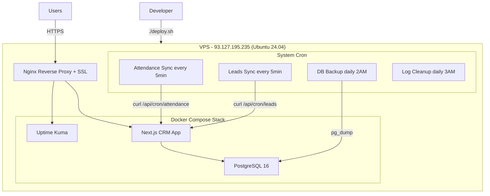
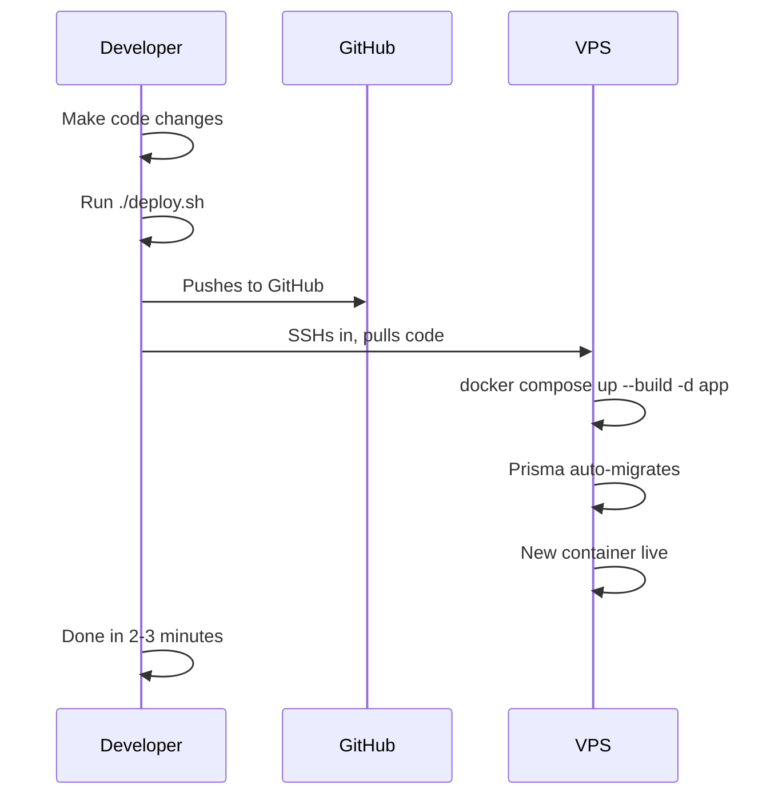

# VPS Deployment Plan - Mediend CRM

## Architecture Overview




---

## Part A: Infrastructure

### Phase 1: VPS Initial Setup

#### 1.1 System Updates and Swap

```bash
apt update && apt upgrade -y && reboot

# After reboot -- add 4GB swap to prevent OOM during Docker builds
fallocate -l 4G /swapfile
chmod 600 /swapfile
mkswap /swapfile
swapon /swapfile
echo '/swapfile none swap sw 0 0' >> /etc/fstab
echo 'vm.swappiness=10' >> /etc/sysctl.conf
sysctl -p
```

#### 1.2 Install Docker, Nginx, Certbot

```bash
curl -fsSL https://get.docker.com | sh
apt install -y nginx certbot python3-certbot-nginx
```

#### 1.3 Firewall

```bash
ufw allow 22 && ufw allow 80 && ufw allow 443 && ufw enable
```

#### 1.4 Clone repo and create env file

```bash
mkdir -p /opt/mediend-crm
cd /opt/mediend-crm
git clone https://github.com/<your-org>/mediend-crm-v2.git .
nano .env.production
```

Key env vars:

```
DATABASE_URL=postgresql://mediend:<password>@postgres:5432/mediend_crm
POSTGRES_PASSWORD=<same password as above>
JWT_SECRET=<openssl rand -base64 32>
NEXT_PUBLIC_APP_URL=https://workspace.mediend.com
NODE_ENV=production
CRON_SECRET=<openssl rand -base64 32>
DEPLOY_COMMIT=<filled automatically by deploy.sh>
DEPLOY_TIME=<filled automatically by deploy.sh>
# ... plus AWS, AI, MySQL, attendance vars
```

`CRON_SECRET` is a new shared secret so only the server's cron can trigger sync endpoints.

---

### Phase 2: Nginx + SSL (on the server)

#### `/etc/nginx/sites-available/mediend-crm`

```nginx
server {
    server_name workspace.mediend.com;

    location / {
        proxy_pass http://127.0.0.1:3000;
        proxy_http_version 1.1;
        proxy_set_header Upgrade $http_upgrade;
        proxy_set_header Connection 'upgrade';
        proxy_set_header Host $host;
        proxy_set_header X-Real-IP $remote_addr;
        proxy_set_header X-Forwarded-For $proxy_add_x_forwarded_for;
        proxy_set_header X-Forwarded-Proto $scheme;
        proxy_cache_bypass $http_upgrade;
    }
}
```

#### `/etc/nginx/sites-available/uptime-kuma`

```nginx
server {
    server_name status.mediend.com;

    location / {
        proxy_pass http://127.0.0.1:3001;
        proxy_http_version 1.1;
        proxy_set_header Upgrade $http_upgrade;
        proxy_set_header Connection 'upgrade';
        proxy_set_header Host $host;
        proxy_set_header X-Real-IP $remote_addr;
        proxy_set_header X-Forwarded-For $proxy_add_x_forwarded_for;
        proxy_set_header X-Forwarded-Proto $scheme;
    }
}
```

#### Enable and get SSL

```bash
ln -s /etc/nginx/sites-available/mediend-crm /etc/nginx/sites-enabled/
ln -s /etc/nginx/sites-available/uptime-kuma /etc/nginx/sites-enabled/
nginx -t && systemctl reload nginx
certbot --nginx -d workspace.mediend.com -d status.mediend.com
```

---

### Phase 3: Cron Jobs (on the server)

Three cron jobs via system crontab, plus a log cleanup job:

```bash
crontab -e
```

```cron
# Attendance sync - every 5 minutes
*/5 * * * * curl -sf -X POST http://localhost:3000/api/cron/attendance -H "Authorization: Bearer $CRON_SECRET" >> /var/log/cron-attendance.log 2>&1

# Leads sync - every 5 minutes
*/5 * * * * curl -sf -X POST http://localhost:3000/api/cron/leads -H "Authorization: Bearer $CRON_SECRET" >> /var/log/cron-leads.log 2>&1

# Database backup - daily at 2 AM UTC
0 2 * * * /opt/backups/pg_backup.sh >> /var/log/pg_backup.log 2>&1

# Cleanup old request logs - daily at 3 AM UTC
0 3 * * * curl -sf -X POST http://localhost:3000/api/cron/cleanup -H "Authorization: Bearer $CRON_SECRET" >> /var/log/cron-cleanup.log 2>&1
```

Note: Since cron doesn't expand `$CRON_SECRET` from `.env`, we'll hardcode the actual secret value in the crontab. Alternatively, create a wrapper script that sources the env file.

#### Backup script: `/opt/backups/pg_backup.sh`

```bash
#!/bin/bash
BACKUP_DIR="/opt/backups/postgres"
TIMESTAMP=$(date +%Y%m%d_%H%M%S)
mkdir -p $BACKUP_DIR
docker exec mediend-crm-postgres-1 \
  pg_dump -U mediend mediend_crm | gzip > "$BACKUP_DIR/mediend_crm_$TIMESTAMP.sql.gz"
find $BACKUP_DIR -name "*.sql.gz" -mtime +7 -delete
echo "[$(date)] Backup: mediend_crm_$TIMESTAMP.sql.gz ($(du -h "$BACKUP_DIR/mediend_crm_$TIMESTAMP.sql.gz" | cut -f1))"
```

---

## Part B: Project Files to Create/Modify

### B1. Create [Dockerfile](Dockerfile)

```dockerfile
FROM node:22-alpine AS base

FROM base AS deps
RUN apk add --no-cache libc6-compat openssl
WORKDIR /app
COPY package.json package-lock.json* ./
COPY prisma ./prisma
RUN npm ci
RUN npx prisma generate

FROM base AS builder
WORKDIR /app
COPY --from=deps /app/node_modules ./node_modules
COPY . .
ARG DEPLOY_COMMIT=unknown
ARG DEPLOY_TIME=unknown
ENV DEPLOY_COMMIT=$DEPLOY_COMMIT
ENV DEPLOY_TIME=$DEPLOY_TIME
RUN npx prisma generate
RUN npm run build

FROM base AS runner
WORKDIR /app
ENV NODE_ENV=production
ENV NEXT_TELEMETRY_DISABLED=1
RUN addgroup --system --gid 1001 nodejs
RUN adduser --system --uid 1001 nextjs
RUN apk add --no-cache openssl
COPY --from=builder /app/public ./public
COPY --from=builder /app/.next/standalone ./
COPY --from=builder /app/.next/static ./.next/static
COPY --from=builder /app/prisma ./prisma
COPY --from=builder /app/node_modules/.prisma ./node_modules/.prisma
COPY --from=builder /app/node_modules/@prisma ./node_modules/@prisma
COPY --from=builder /app/node_modules/prisma ./node_modules/prisma
USER nextjs
EXPOSE 3000
ENV PORT=3000
ENV HOSTNAME="0.0.0.0"
CMD ["sh", "-c", "npx prisma migrate deploy && node server.js"]
```

Build args `DEPLOY_COMMIT` and `DEPLOY_TIME` are injected by `deploy.sh` so the observability panel can show what's running.

### B2. Create [.dockerignore](.dockerignore)

```
node_modules
.next
.git
.env*
*.md
deploy.sh
```

### B3. Create [docker-compose.yml](docker-compose.yml)

```yaml
services:
  postgres:
    image: postgres:16-alpine
    restart: always
    environment:
      POSTGRES_DB: mediend_crm
      POSTGRES_USER: mediend
      POSTGRES_PASSWORD: ${POSTGRES_PASSWORD}
    volumes:
      - pgdata:/var/lib/postgresql/data
    ports:
      - "127.0.0.1:5432:5432"
    healthcheck:
      test: ["CMD-SHELL", "pg_isready -U mediend -d mediend_crm"]
      interval: 10s
      timeout: 5s
      retries: 5

  app:
    build:
      context: .
      dockerfile: Dockerfile
      args:
        DEPLOY_COMMIT: ${DEPLOY_COMMIT:-unknown}
        DEPLOY_TIME: ${DEPLOY_TIME:-unknown}
    restart: always
    ports:
      - "127.0.0.1:3000:3000"
    env_file:
      - .env.production
    depends_on:
      postgres:
        condition: service_healthy

  uptime-kuma:
    image: louislam/uptime-kuma:1
    restart: always
    ports:
      - "127.0.0.1:3001:3001"
    volumes:
      - uptime-kuma-data:/app/data

volumes:
  pgdata:
  uptime-kuma-data:
```

### B4. Modify [next.config.ts](next.config.ts)

```typescript
import type { NextConfig } from "next";

const nextConfig: NextConfig = {
  output: "standalone",
};

export default nextConfig;
```

### B5. Create [deploy.sh](deploy.sh)

```bash
#!/bin/bash
set -e

VPS_IP="93.127.195.235"
VPS_USER="root"
APP_DIR="/opt/mediend-crm"

COMMIT=$(git rev-parse --short HEAD)
TIMESTAMP=$(date -u +"%Y-%m-%dT%H:%M:%SZ")

echo "===> Pushing code to GitHub..."
git push origin main

echo "===> Deploying commit $COMMIT to VPS..."
ssh ${VPS_USER}@${VPS_IP} << ENDSSH
  cd ${APP_DIR}
  echo "--- Pulling latest code..."
  git pull origin main
  echo "--- Setting deploy metadata..."
  export DEPLOY_COMMIT=${COMMIT}
  export DEPLOY_TIME=${TIMESTAMP}
  echo "--- Building and restarting app container..."
  DEPLOY_COMMIT=${COMMIT} DEPLOY_TIME=${TIMESTAMP} docker compose up --build -d app
  echo "--- Cleaning up old images..."
  docker image prune -f
  echo "--- Status:"
  docker compose ps
ENDSSH

echo ""
echo "===> Deployed $COMMIT at $TIMESTAMP"
echo "===> App: https://workspace.mediend.com"
echo "===> Status: https://status.mediend.com"
```

---

## Part C: Observability System

The observability dashboard is a separate admin-only page at `/admin/system` in the CRM app. It uses dedicated API endpoints and two new database tables for logging.

### C1. New Prisma Models

Add to [prisma/schema.prisma](prisma/schema.prisma):

```prisma
model CronJobLog {
  id               String   @id @default(cuid())
  jobName          String   // "attendance_sync" | "leads_sync" | "db_backup" | "log_cleanup"
  status           String   // "success" | "error"
  durationMs       Int
  recordsProcessed Int?
  message          String?
  error            String?  @db.Text
  createdAt        DateTime @default(now())

  @@index([jobName, createdAt])
  @@index([createdAt])
}

model RequestLog {
  id        String   @id @default(cuid())
  method    String
  path      String
  status    Int
  durationMs Int
  userId    String?
  ip        String?
  error     String?  @db.Text
  createdAt DateTime @default(now())

  @@index([createdAt])
  @@index([status, createdAt])
  @@index([path, createdAt])
}
```

### C2. API Request Logging Middleware

Create a Next.js middleware at [middleware.ts](middleware.ts) (or enhance the existing one) that:

1. Records start time
2. Lets the request pass through
3. On response, logs `{ method, path, status, durationMs, userId, ip }` to the `RequestLog` table

Since Next.js middleware runs on the Edge and can't use Prisma directly, we'll instead use a **lightweight API wrapper approach**: create a `lib/request-logger.ts` utility that API route handlers call, or use Next.js `instrumentation.ts` to hook into requests.

Practical approach: Add logging in a shared wrapper used by API routes, or use a Next.js `afterResponse` pattern. The key is to log asynchronously (fire-and-forget) so it doesn't slow down requests.

### C3. Cron Wrapper Endpoints

Create three new API routes that wrap the existing sync endpoints and log results to `CronJobLog`:

- `**/api/cron/attendance**` -- calls the attendance sync logic, logs result to `CronJobLog`
- `**/api/cron/leads**` -- calls the leads sync logic, logs result to `CronJobLog`
- `**/api/cron/cleanup**` -- deletes `RequestLog` entries older than 7 days, deletes `CronJobLog` entries older than 30 days

All three authenticate via `Authorization: Bearer <CRON_SECRET>` header.

### C4. Observability API Endpoints

All under `/api/admin/system/*`, protected by MD/ADMIN role check:


| Endpoint                         | Data Source                                         | Returns                                                    |
| -------------------------------- | --------------------------------------------------- | ---------------------------------------------------------- |
| `/api/admin/system/health`       | Prisma `SELECT 1`, `process.uptime()`               | App status, DB status, uptime                              |
| `/api/admin/system/metrics`      | Node.js `os` module, `child_process` for `df`       | CPU %, RAM usage, disk usage                               |
| `/api/admin/system/logs`         | `RequestLog` table                                  | Paginated API request logs, filterable by path/status/date |
| `/api/admin/system/cron-logs`    | `CronJobLog` table                                  | Cron execution history, filterable by job name             |
| `/api/admin/system/db`           | PostgreSQL `pg_database_size()`, `pg_stat_activity` | DB size, active connections, table sizes                   |
| `/api/admin/system/errors`       | `RequestLog` where status >= 500                    | Recent errors grouped by path                              |
| `/api/admin/system/active-users` | `RequestLog` from last 15 min, joined with User     | Users with recent activity                                 |
| `/api/admin/system/deploy`       | `DEPLOY_COMMIT` + `DEPLOY_TIME` env vars            | Current version and deploy timestamp                       |


### C5. Observability Dashboard UI

A new page at [app/admin/system/page.tsx](app/admin/system/page.tsx), accessible only to MD/ADMIN roles.

**Layout**: Tabbed interface using existing Radix UI Tabs component, with the following tabs:

**Tab 1 -- Overview**

- Health status card (green/red)
- System metrics: CPU, RAM, disk as progress bars
- Current deploy: commit hash + deploy time
- Quick stats: requests today, errors today, active users now

**Tab 2 -- API Logs**

- Table of recent requests: timestamp, method, path, status (color-coded), duration, user
- Filters: date range, status code, path search
- Pagination
- Auto-refresh toggle

**Tab 3 -- Cron Jobs**

- Three cards (Attendance Sync, Leads Sync, Log Cleanup) each showing:
  - Last run status (success/error badge)
  - Last run time + duration
  - Records processed
  - Next expected run
- Below: full history table, filterable by job name

**Tab 4 -- Database**

- Total database size
- Table sizes (top 10 largest)
- Active connections count
- Connection pool usage

**Tab 5 -- Errors**

- Errors grouped by path with count
- Expandable to see individual error messages
- Time range filter

**Tab 6 -- Active Users**

- List of users active in the last 15 minutes
- Shows: name, role, last request path, last active time

Uses existing UI components: Radix Tabs, `recharts` for charts, `@tanstack/react-query` for data fetching with auto-refresh.

---

## Part D: First Deployment Checklist

On the server, after all Phase 1-3 setup:

```bash
cd /opt/mediend-crm

# 1. Create .env.production with all variables
nano .env.production

# 2. Start everything
docker compose up -d

# 3. Verify all 3 containers are healthy
docker compose ps

# 4. Watch app startup + migration logs
docker compose logs -f app

# 5. First-time only: seed the database
docker compose exec app npx prisma db seed

# 6. Set up cron jobs
chmod +x /opt/backups/pg_backup.sh
crontab -e   # Add the 4 cron entries from Phase 3

# 7. Set up Uptime Kuma at https://status.mediend.com
#    Add monitors: HTTP, TCP, Ping
```

---

## Daily Workflow




---

## Summary of All Files

**Create:**

- [Dockerfile](Dockerfile) -- multi-stage Docker build
- [.dockerignore](.dockerignore) -- keep image small
- [docker-compose.yml](docker-compose.yml) -- full stack definition
- [deploy.sh](deploy.sh) -- one-command deploy from local machine
- [app/api/health/route.ts](app/api/health/route.ts) -- health check
- [app/api/cron/attendance/route.ts](app/api/cron/attendance/route.ts) -- cron wrapper for attendance sync
- [app/api/cron/leads/route.ts](app/api/cron/leads/route.ts) -- cron wrapper for leads sync
- [app/api/cron/cleanup/route.ts](app/api/cron/cleanup/route.ts) -- old log cleanup
- [app/api/admin/system/*/route.ts](app/api/admin/system/) -- 8 observability API endpoints
- [app/admin/system/page.tsx](app/admin/system/page.tsx) -- observability dashboard UI
- [lib/request-logger.ts](lib/request-logger.ts) -- async API request logging utility

**Modify:**

- [next.config.ts](next.config.ts) -- add `output: "standalone"`
- [prisma/schema.prisma](prisma/schema.prisma) -- add `CronJobLog` and `RequestLog` models

---

## Resource Estimates

- **PostgreSQL**: ~300-500MB RAM
- **Next.js App**: ~300-500MB RAM
- **Nginx**: ~10MB
- **Uptime Kuma**: ~100MB
- **Total steady-state**: ~1-1.2GB RAM (very comfortable on 4GB)
- **During builds**: ~2-3GB (swap handles overflow)

